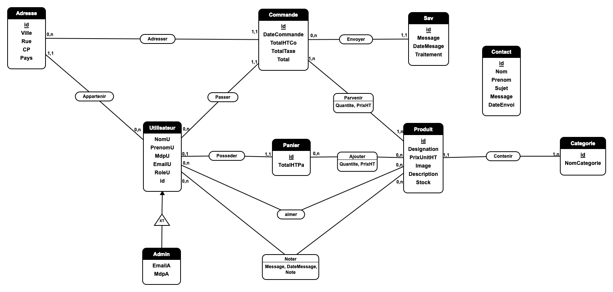

# StreamCorner

StreamCorner est un projet de site e-commerce réalisé dans le cadre de ma formation en BTS SIO. Il a été développé pour mettre en pratique la conception d'une application web complète : modélisation des données, développement Symfony, interface d'administration, gestion client et construction d'une expérience utilisateur cohérente autour d'une boutique en ligne.

## But du projet

Le but de StreamCorner est de proposer une boutique spécialisée dans le matériel de streaming :

- consultation d'une page d'accueil orientée produit ;
- navigation dans un catalogue filtrable ;
- accès à des fiches produits détaillées ;
- gestion du panier, des favoris et des commandes ;
- création d'un compte client ;
- administration des produits, catégories, utilisateurs, commandes, contacts et éléments liés à la boutique.

Le projet sert aussi de support technique pour montrer la maîtrise de Symfony, de Doctrine, de Twig, de Docker et d'une organisation MVC.

## Thème et méthode de création

L'identité visuelle repose sur un univers sombre, technique et orienté setup de streaming. Le site met en avant des produits comme des stream decks, micros, webcams, éclairages, cartes de capture et accessoires.

La création s'est faite en plusieurs étapes :

1. Conception du modèle de données à partir d'un MCD.
2. Création des entités Doctrine correspondant aux tables principales.
3. Mise en place des contrôleurs Symfony pour les pages publiques, le compte client et l'administration.
4. Construction des formulaires avec le composant Form de Symfony.
5. Développement des templates Twig pour séparer l'affichage de la logique.
6. Ajout progressif du design responsive, des interactions JavaScript et des pages d'administration.
7. Intégration des images produits, de la galerie, du panier, des favoris et des commandes.

## Fonctionnement général

StreamCorner est organisé autour de trois grands espaces.

### Partie publique

La partie publique permet de découvrir la boutique :

- page d'accueil avec hero, carte cliquable, univers produits et produits à la une ;
- catalogue avec filtres par catégorie, prix, stock et tri ;
- fiches produits avec galerie d'images, prix, stock, avis et ajout au panier ;
- pages légales ;
- formulaire de contact.

### Espace client

Un utilisateur connecté peut :

- gérer son profil ;
- consulter ses commandes ;
- gérer ses adresses ;
- ajouter des produits en favoris ;
- gérer son panier ;
- valider une commande.

### Administration

L'administration permet de piloter les principales données du site :

- produits et images produits ;
- catégories ;
- utilisateurs ;
- commandes ;
- paniers et lignes ;
- avis ;
- SAV ;
- messages de contact ;
- droits et profils administrateurs.

## Structure du projet

Le dépôt est organisé ainsi :

```text
.
├── Dockerfile
├── docker-compose.yml
└── StreamCorner/
    ├── bin/
    ├── config/
    ├── migrations/
    ├── public/
    │   └── assets/
    │       ├── css/
    │       ├── images/
    │       └── js/
    ├── src/
    │   ├── Controller/
    │   ├── Entity/
    │   ├── Form/
    │   ├── Repository/
    │   ├── Security/
    │   └── Service/
    ├── templates/
    ├── composer.json
    └── symfony.lock
```

Les dossiers principaux :

- `src/Entity` contient les classes liées aux tables de la base de données.
- `src/Controller` contient la logique des routes et des pages.
- `src/Form` contient les formulaires Symfony.
- `src/Repository` contient les requêtes personnalisées.
- `templates` contient les vues Twig.
- `public/assets` contient les fichiers CSS, JavaScript et les images.
- `migrations` contient l'évolution de la structure de la base de données.

## MCD




## Outils et technologies utilisés

- PHP 8.2
- Symfony 6.4
- Doctrine ORM
- Doctrine Migrations
- Twig
- Symfony Form
- Symfony Security
- Symfony Validator
- Composer
- Docker
- Apache
- MariaDB
- phpMyAdmin
- HTML
- CSS
- JavaScript
- Git et GitHub

## Lancement local avec Docker

Depuis la racine du dépôt :

```bash
docker compose up -d --build
```

Installer les dépendances PHP dans le conteneur si nécessaire :

```bash
docker compose exec php composer install
```

Appliquer les migrations :

```bash
docker compose exec php php /var/www/html/StreamCorner/bin/console doctrine:migrations:migrate
```

Accès local :

- site : `http://localhost:8000/streamCorner`
- phpMyAdmin : `http://localhost:8080`

## Statut

Le projet est une application e-commerce pédagogique. Il a pour but de démontrer la capacité à concevoir, développer et organiser un projet web complet avec Symfony, Docker et une base de données relationnelle.
